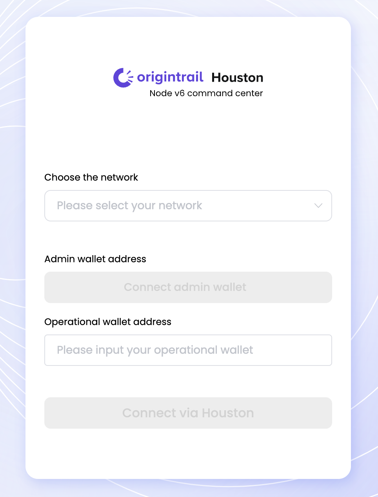
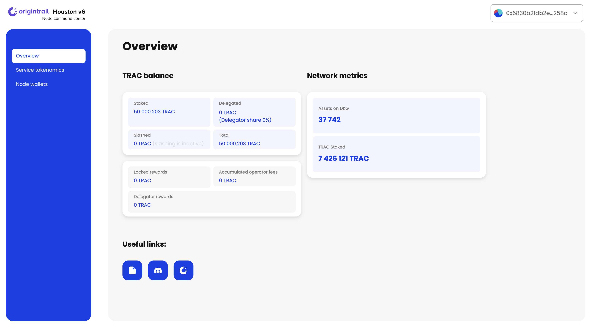
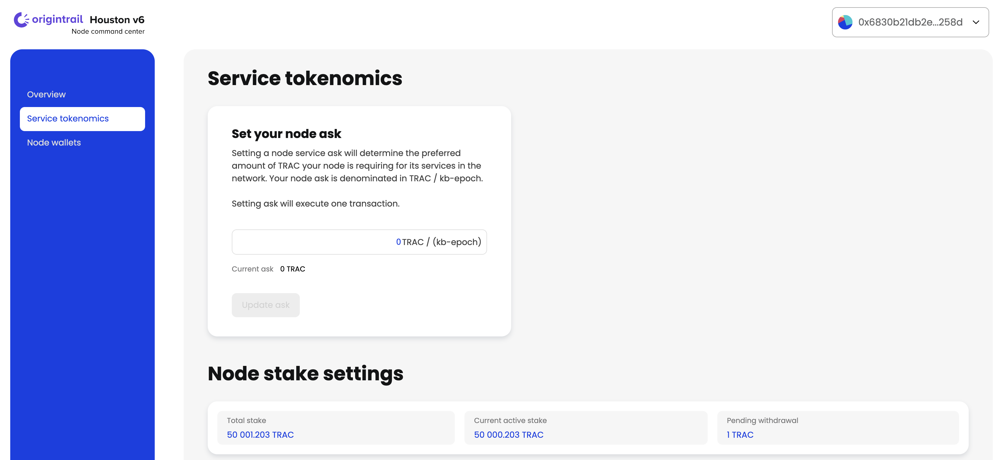
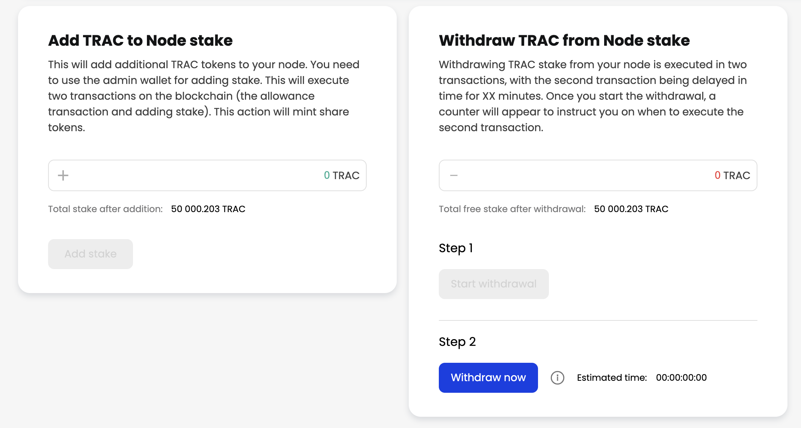
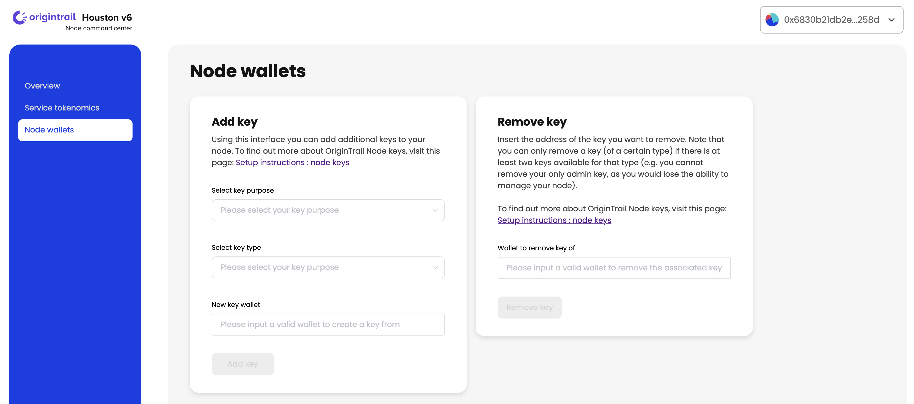

# Houston V6 - Node command center

## Houston V6 is an application that allows node runners to easily control their nodes through an easy to understand UI.

There are two ways you can use the Houston application:
- Via a hosted application, which is available at the following link: https://houston.origintrail.io/ or
- Run Houston Web application locally by following the setup instructions.

## Houston is an open source project and we welcome your contributions on the [official project repository.](https://github.com/OriginTrail/houston-v6/)

## Usage instructions
>⚠️ Note: The Houston application currently requires the Metamask browser extension to be installed in order to connect to the node. Additional wallets will be supported in the future releases.

- When Houston application opens, you will be presented with a login form. Make sure to choose the right network (OriginTrail DKG Mainnet or OriginTrail DKG Testnet).
- After choosing the network you will have to connect and authenticate your node's admin key with Metamask by clicking the “**Connect admin wallet**” button.
- Paste your node’s operational wallet address into the “**Operational wallet address**” input field.
- Connect by clicking the “Connect via Houston” button.

  

Houston currently helps you interact with OriginTrail DKG smart contracts. In the future versions Houston will enable connecting to your nodes directly as well.

## Overview:
The Overview section shows general information about your node TRAC balance and network metrics.




## Service tokenomics:
Under “**Service tokenomics**” section, you’re able to manage TRAC stake settings on the node as well as updating:

- Ask parameter, which will determine the preferred amount of TRAC your node is asking for its services in the network,
- Add and withdraw TRAC stake. Note that both operations require executing 2 transactions.





## Node wallets:
This section allows node runners to add additional keys (wallets) or remove keys from the node. OriginTrail V6 node operates with 2 key types (admin key and operational key).


Houston will allow a node runner to remove a key (of a certain type) if there are at least two keys available for that type (e.g. you cannot remove your only admin key, as you would lose the ability to manage your node).



To find out more about OriginTrail Node keys, visit the following page: [Setup instructions: Node keys.](https://docs.origintrail.io/decentralized-knowledge-graph-layer-2/testnet-node-setup-instructions/node-keys)


## Upcoming Houston features:
With the future versions of Houston application, multiple features are to be introduced, such as connecting to your node and token delegation.
If you have ideas on how to improve or extend Houston, we’d love to have you contribute to the project [via the official repository.](https://github.com/OriginTrail/houston-v6)

In order to stay in the loop with the latest Houston & OriginTrail developments, please join our [Discord](https://discordapp.com/invite/FCgYk2S) channel and follow our social media accounts.


## #TraceOn


# Setup Houston locally:
### Requirements:
- Node.js: v16

### How to run Houston:
- Clone the project:
```
git clone https://github.com/OriginTrail/houston-v6.git  
```
- Install dependencies:
```
cd houston-v6 && npm install
```
- Run Houston application:
```
npm run serve
```

The Houston application will be available at http://localhost:8080/ in the browser of your choice.

- Compile and minify for production purposes:
```
npm run build
```

## Contribution guidelines
For more information on how to contribute, please follow this [link](https://docs.origintrail.io/useful-resources/contribute).

